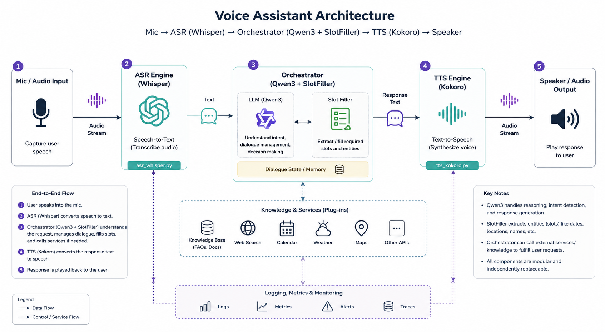

# 🎙️ On-Device Banking Agent

A fully local, real-time voice assistant for banking operations, powered by a **fine-tuned Qwen3-0.6B** model. The entire pipeline — speech recognition, language understanding, and speech synthesis — runs on a single consumer GPU with no cloud API calls.

```
Microphone → Faster Whisper (ASR) → Fine-tuned Qwen3-0.6B (Intent + Slots) → Kokoro-82M (TTS) → Speaker
```

[](LICENSE)
[](https://www.python.org/)
[]()
[]()

---

## ✨ Highlights

- **100% local inference** — no internet required after setup
- **< 1 second latency** — end-to-end voice-in to voice-out
- **14 banking intents** with multi-turn slot elicitation (e.g., "transfer $500 from checking to savings")
- **Fine-tuned on ~5K dialogues** using LoRA (only 1.67% of parameters trained)
- **Deterministic dialogue manager** — no hallucinated actions; the SLM only extracts intent + slots, the orchestrator handles all logic
- **Dual mode** — voice mode (mic + speaker) or text mode (terminal only)

---

## 🏗️ Architecture

<p align="center">
  
</p>

| Component | Model | Size | Role |
|-----------|-------|------|------|
| ASR | Faster Whisper `base.en` | ~150 MB | Speech → Text |
| Brain | Fine-tuned Qwen3-0.6B | ~1.2 GB (F16 GGUF) | Intent classification + slot extraction |
| TTS | Kokoro-82M | ~82 MB | Text → Speech |

> See [docs/architecture.md](docs/architecture.md) for a full technical deep-dive.

---

## 📋 Supported Banking Intents

| Intent | Example Utterance | Required Slots |
|--------|------------------|----------------|
| **Check Balance** | "What's my savings balance?" | `account_type` |
| **Get Statement** | "Send me my checking statement for last month" | `account_type`, `period` |
| **Transfer Money** | "Move $200 from checking to savings" | `amount`, `from_account`, `to_account` |
| **Pay Bill** | "Pay $150 to AT&T" | `payee`, `amount` |
| **Cancel Card** | "Cancel my credit card ending in 4523" | `card_type`, `card_last_four` |
| **Replace Card** | "I need a new debit card, mine is damaged" | `card_type`, `card_last_four` |
| **Activate Card** | "Activate my new card ending in 7891" | `card_last_four` |
| **Reset PIN** | "Reset the PIN on my debit card" | `card_type`, `card_last_four` |
| **Report Fraud** | "There's a $300 charge I didn't make" | `card_type`, `card_last_four`, `transaction_amount` |
| **Speak to Human** | "Connect me to an agent" | *(none)* |
| **Greeting** | "Hello" | *(none)* |
| **Goodbye** | "Bye" | *(none)* |
| **Thank You** | "Thanks!" | *(none)* |
| **Intent Unclear** | *(fallback)* | *(none)* |

The assistant will **automatically ask follow-up questions** if required slots are missing (e.g., "Could you provide the last 4 digits of the card?").

---

## 🚀 Quickstart

### Prerequisites

| Requirement | Details |
|-------------|---------|
| **GPU** | NVIDIA GPU with ≥ 6 GB VRAM (tested on RTX 3070 Ti) |
| **CUDA** | CUDA 12.x with cuDNN |
| **Python** | 3.10 – 3.12 |
| **llama.cpp** | Pre-built `llama-server` binary ([build instructions](https://github.com/ggml-org/llama.cpp#build)) |
| **Audio** | Working microphone + speakers (voice mode only) |
| **OS** | Windows (WSL2) or Linux |

### Step 1 — Clone & Install

```bash
git clone https://github.com/yourusername/on-device-banking-agent.git
cd on-device-banking-agent

# Create virtual environment
python -m venv venv
source venv/bin/activate   # Linux/WSL
# venv\Scripts\activate    # Windows

# Install runtime dependencies
pip install -r requirements.txt
```

### Step 2 — Download / Prepare the Model

You need a fine-tuned Qwen3-0.6B model in **GGUF format**. Either:

**Option A** — Use the pre-trained GGUF (if available):
```bash
# Place your .gguf file in a known location, e.g.:
mkdir -p models/
# Copy or download the GGUF file into models/
hf download https://huggingface.co/roachrsp/qwen3-0.6B-banking-voice-assistant --local-dir models/qwen3-banking-voice-assistant
```

**Option B** — Fine-tune from scratch (see [Training](training/finetune_qwen3.ipynb) section).
```bash
# For fintuning, download the base qwen3-0.6B model
hf download https://huggingface.co/Qwen/Qwen3-0.6B --local-dir models/Qwen3-Qwen3-0.6B
```


### Step 3 — Start the Inference Server

Launch `llama-server` with your GGUF model:

```bash
llama-server \
  -m models/qwen3_06b_voice_banking_f16.gguf \
  --port 7002 \
  -ngl 99 \
  -c 2048 \
  --predict 64 \
  --temp 0.0 \
  -rea off \
  --no-context-shift \
  --min-p 0.05
```

> **Key flags**: `-ngl 99` offloads all layers to GPU, `--predict 64` caps generation length (the model only outputs short JSON), `-rea off` disables reasoning tokens for speed.

### Step 4 — Run the Voice Assistant

**Voice mode** (microphone + speaker):
```bash
python app.py --model qwen3_06b_voice_banking_f16.gguf --port 7002
```

**Text mode** (terminal only, no audio hardware needed):
```bash
python app.py --mode text --model qwen3_06b_voice_banking_f16.gguf --port 7002
```

### CLI Options

| Flag | Default | Description |
|------|---------|-------------|
| `--mode` | `voice` | `voice` (mic+speaker) or `text` (terminal) |
| `--model` | `model` | Model name/filename served by llama-server |
| `--port` | `8092` | Port of the llama-server instance |
| `--base-url` | *(auto)* | Full base URL (overrides `--port`) |
| `--api-key` | `EMPTY` | API key if your server requires one |
| `--debug` | `false` | Print raw SLM output each turn |

---

## 🧠 Approach

### The Core Idea

Instead of using a large general-purpose LLM for the full dialogue, we **fine-tune a tiny 0.6B model to do one thing extremely well**: classify the user's banking intent and extract slot values from noisy ASR transcripts.

All dialogue logic (slot elicitation, state tracking, response generation) is handled by a **deterministic orchestrator** — no hallucination risk.

### Training Pipeline

1. **Base model**: [Qwen3-0.6B](https://huggingface.co/Qwen/Qwen3-0.6B)
2. **Method**: LoRA fine-tuning via [Unsloth](https://github.com/unslothai/unsloth) (2× faster, 50% less memory)
3. **Data**: ~5,000 multi-turn banking dialogues in OpenAI function-calling format
4. **Output format**: The model learns to output compact JSON like `{"name": "check_balance", "arguments": {"account_type": "savings"}}`
5. **Training time**: ~11 minutes on a single RTX 3070 Ti (1 epoch)
6. **Deployment**: Converted to GGUF F16 → served via llama.cpp for low-latency inference

### Why This Architecture?

| Design Choice | Rationale |
|---|---|
| **0.6B model** | Fast enough for real-time voice (< 100ms inference) |
| **LoRA** | Train only 1.67% of parameters — prevents catastrophic forgetting |
| **JSON output** | Compact, deterministic — easier to parse than natural language |
| **Deterministic orchestrator** | No hallucinated API calls; slot validation is rule-based |
| **Faster Whisper** | CTranslate2 backend gives 4× speedup over vanilla Whisper |
| **Kokoro-82M** | Fully local TTS, no network latency |

---

## 🔧 Fine-tuning

To fine-tune the model yourself:

```bash
# Install training dependencies (GPU environment)
pip install -r requirements-training.txt
```

Then open the notebook:
```bash
jupyter notebook training/finetune_qwen3.ipynb
```

The notebook walks through:
1. Loading Qwen3-0.6B with Unsloth
2. Applying LoRA adapters
3. Formatting training data into the Qwen chat template
4. Training with SFTTrainer
5. Exporting LoRA adapters + merged 16-bit weights
6. Converting to GGUF for llama.cpp

### Training Data Format

Each line of the JSONL training file should follow OpenAI's multi-turn format:

```json
{
  "messages": [
    {"role": "user", "content": "I want to check my savings balance"},
    {"role": "assistant", "tool_calls": [{"function": {"name": "check_balance", "arguments": {"account_type": "savings"}}}]},
    {"role": "user", "content": "Thanks, goodbye"},
    {"role": "assistant", "tool_calls": [{"function": {"name": "goodbye", "arguments": {}}}]}
  ]
}
```

The notebook's data augmentation cell can randomise numerical values (card numbers, amounts) to improve generalisation.

---

## 📁 Project Structure

```
on-device-banking-agent/
│
├── app.py                          # Entry point (voice + text modes)
├── requirements.txt                # Runtime dependencies
├── requirements-training.txt       # Fine-tuning dependencies
├── .gitignore                      # Git ignore rules
├── LICENSE                         # MIT License
├── README.md                       # This file
│
├── src/                            # Core application package
│   ├── __init__.py
│   ├── asr_whisper.py              # ASR — Faster Whisper engine
│   ├── tts_kokoro.py               # TTS — Kokoro-82M engine
│   ├── orchestrator_qwen.py        # SLM client + dialogue manager
│   └── config.py                   # Tool definitions, templates, prompts
│
├── training/                       # Fine-tuning resources
│   └── finetune_qwen3.ipynb        # Step-by-step fine-tuning notebook
│
└── docs/                           # Documentation
    ├── architecture.md             # System architecture deep-dive
    └── architecture_diagram.png    # Architecture diagram
```

---

## 🐛 Troubleshooting

| Problem | Solution |
|---------|----------|
| **PyAudio install fails** | Install PortAudio first: `sudo apt install portaudio19-dev` (Linux) or use `pipwin install pyaudio` (Windows) |
| **"No CUDA device"** | Ensure CUDA toolkit is installed and `torch.cuda.is_available()` returns `True` |
| **Bot hears its own speech** | The echo cancellation should handle this. If not, lower your speaker volume or use headphones |
| **Slow transcription** | Ensure Faster Whisper is using CUDA: check for `device="cuda"` in the ASR initialization |
| **"Connection refused" from SLM** | Make sure `llama-server` is running on the specified port before starting the assistant |
| **Model outputs garbage** | Ensure the GGUF was converted from the fine-tuned (not base) model. The system prompt must match what was used during training |

---

## 📄 License

This project is licensed under the MIT License — see the [LICENSE](LICENSE) file for details.

The base model (Qwen3-0.6B) is subject to its own license from [Qwen](https://huggingface.co/Qwen/Qwen3-0.6B).

## Acknowledgements
Thanks to @distil-labs for their tool schema and synthetic data from the repo https://github.com/distil-labs/distil-voice-assistant-banking and @Unsloth for their finetuning notebooks 
